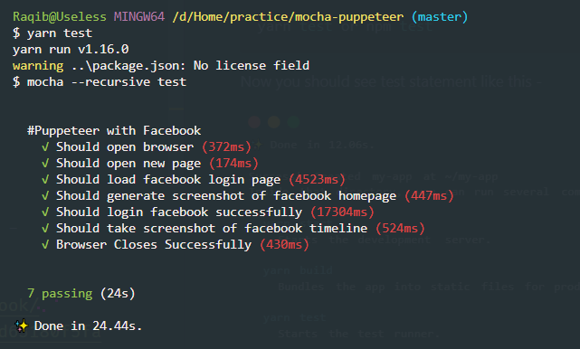

# Mocha Puppeteer

Basic testing of JavaScript apps with Mocha, Chai and Puppeteer. Here we use async and awit to call promise function.

## Quick Start

### Install
```sh
git clone https://github.com/uigalaxy/mocha-puppeteer.git
cd mocha-puppeteer
yarn or npm install
```

### Usage

To make facebook credential create an .env file like given .env.example. Now you’re good to go.


### Run Test

```sh
yarn test or npm test
```
Now you should see some test statements in your terminal like below. 

<p align='center'>

</p>

And it generate a `timeline.png` from your facebook timeline in your project's root folder like below.

<p align='center'>

</p>

Head to `./test/puppeteer.test.js` and start to hack! Happy Coding!
